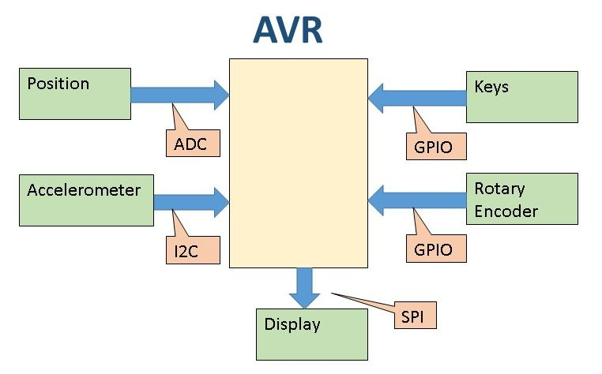
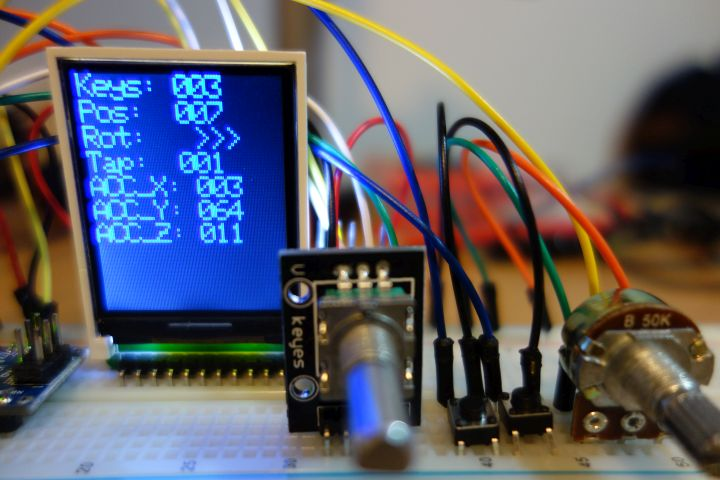
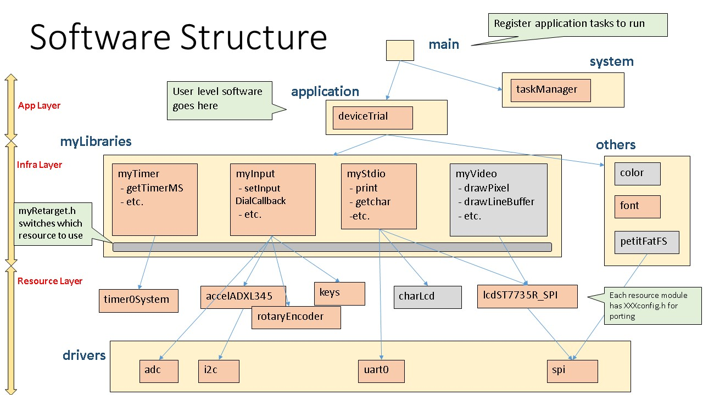

# Input Device Trial

This is an AVR (ATmega 328) application to try several input devices (key, position, rotary encoder, and accelerometer) and display output using GPIO, ADC, I2C and SPI. The accelerometer is used to measure gravity and tap actions. Simple task manager, which is like OS, is also implemented.




Link to youtube is bellow:  
[](https://youtu.be/XTrDPzpv7VY)


## Environment
* Atmel Studio 7.0

## Devices
* ATmega328P (not arduino)
* ST7735R Display
* ADXL345 Accelerometer

## Software Structure


## Portmap
```
## IO
PORTA0 = N/A
PORTA1 = N/A
PORTA2 = N/A
PORTA3 = N/A
PORTA4 = N/A
PORTA5 = N/A
PORTA6 = N/A
PORTA7 = N/A
PORTB0 = 
PORTB1 = LCD_ST7735_DC
PORTB2 = LCD_ST7735_CS
PORTB3 = LCD_ST7735_MOSI
PORTB4 = 
PORTB5 = LCD_ST7735_SCK
PORTB6 = XTAL1
PORTB7 = XTAL2
PORTC0 = (FATFS_MMC_MISO,)	INPUT_RotaryEncoder_A : IN
PORTC1 = (FATFS_MMC_MOSI,)	INPUT_RotaryEncoder_B : IN
PORTC2 = (FATFS_MMC_CK,)	INPUT_SW0
PORTC3 = (FATFS_MMC_CS,)	INPUT_SW1
PORTC4 = I2C_SDA
PORTC5 = I2C_SCL
PORTC6 = RESET
PORTC7 = N/A
PORTD0 = RX : IN
PORTD1 = TX : OUT
PORTD2 = (CHAR_LCD_EN : OUT)
PORTD3 = (CHAR_LCD_RS : OUT)
PORTD4 = (CHAR_LCD_D4 : OUT)
PORTD5 = (CHAR_LCD_D5 : OUT)
PORTD6 = (CHAR_LCD_D6 : OUT)
PORTD7 = (CHAR_LCD_D7 : OUT)
ADC6   = INPUT_POS0
ADC7   = (INPUT_POS1)

## Function
USART0 = COM
TIMER0 = System Timer (1msec)
TIMER1 = 
TIMER2 = 
SIO = LCD_ST7735
I2C = Accelerometer (ADXL345)
```